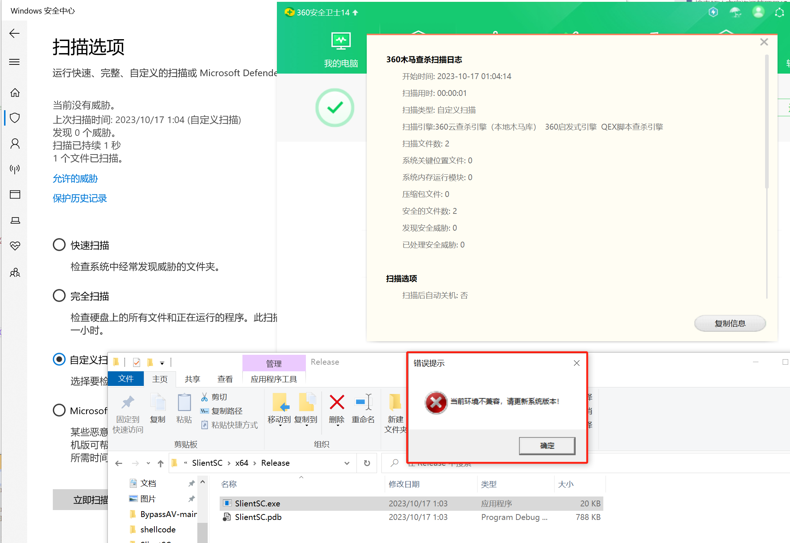
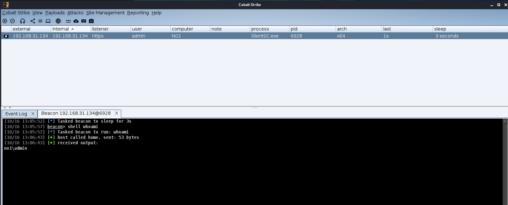
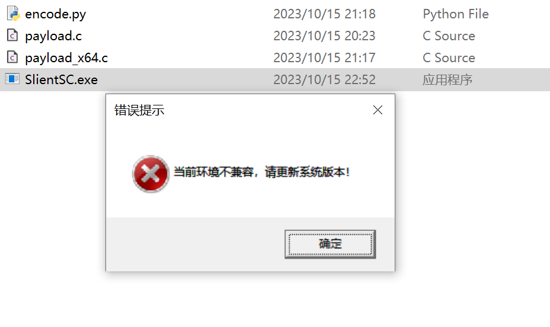
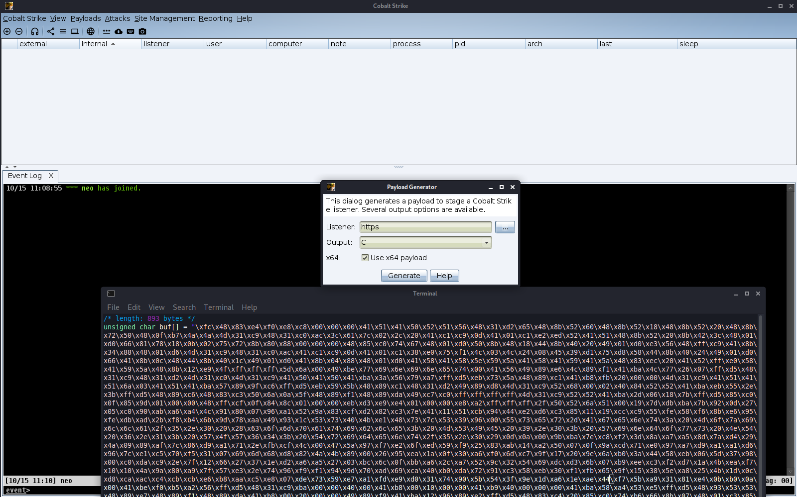
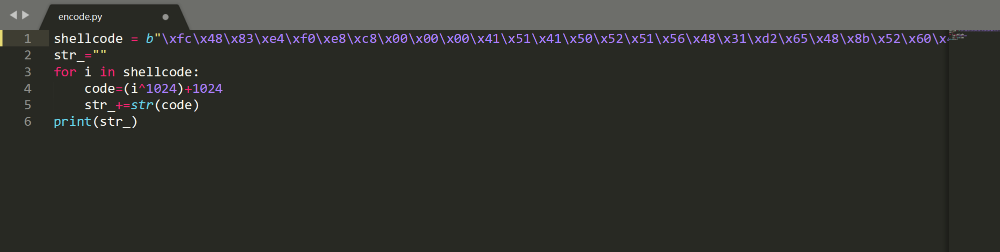
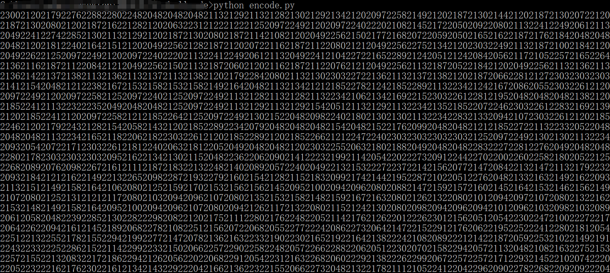
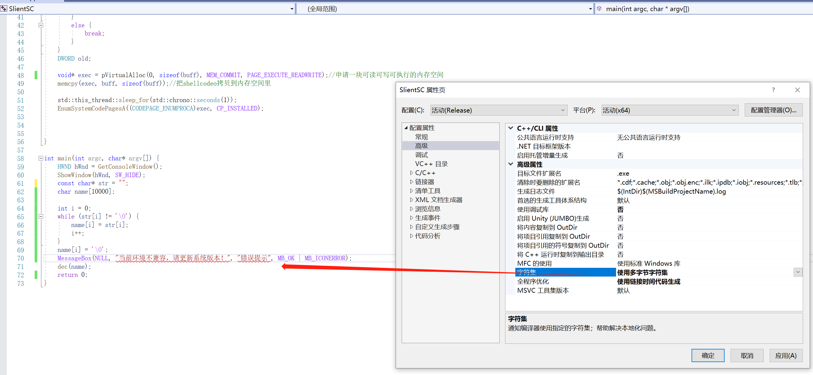

# 鱼饵-10.15 红队免杀分享

本次代码来源"旺崽"，原文链接：[https://forum.butian.net/share/1848](https://forum.butian.net/share/1848 "https://forum.butian.net/share/1848")

经猫蛋儿修改部分代码后，在测试10.17日 360 df 均能绕过

在这里修改隐藏原版黑框，并弹出错误提示让程序更加真实。

首先在CS4.9中生成.C格式的shellcode

将所有shellcode取出，放入[encode.py](http://encode.py "encode.py")中的shellcode字符串中

随后生成加密后密文，放入C++代码

将生成模式改为"release"并调整实参兼容问题，随后生成即可正常使用

猫蛋儿安全公众号

